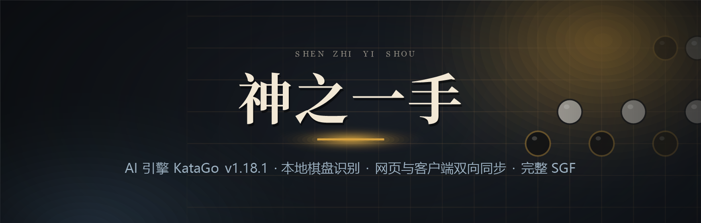
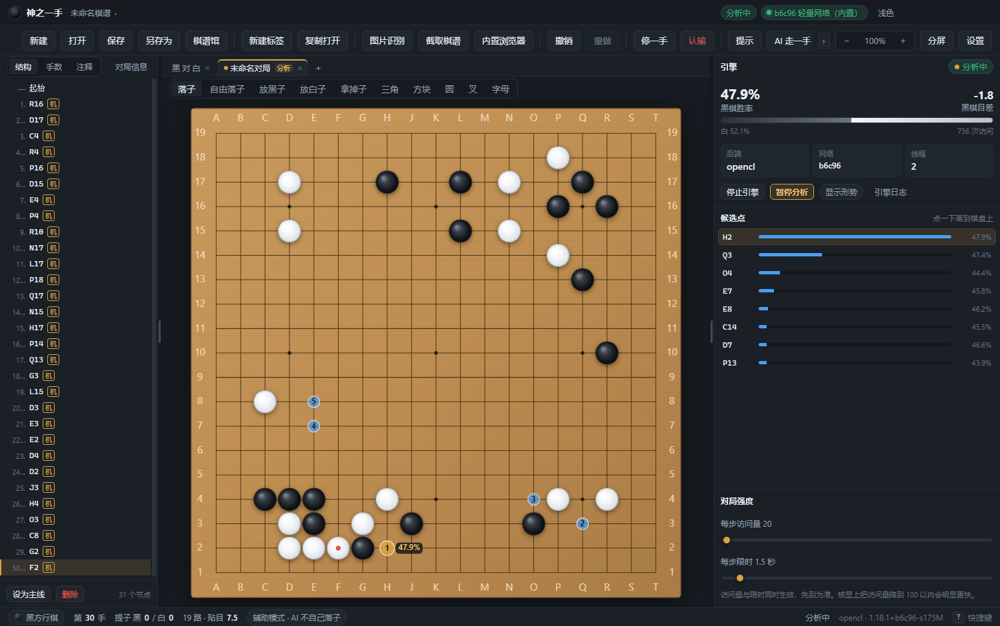
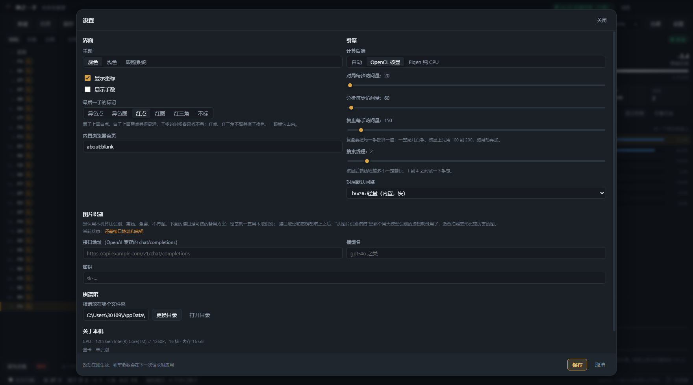
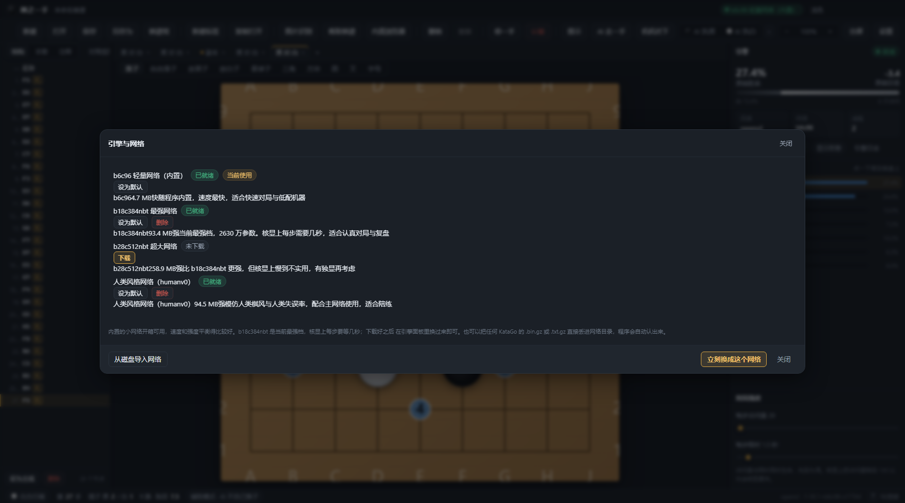
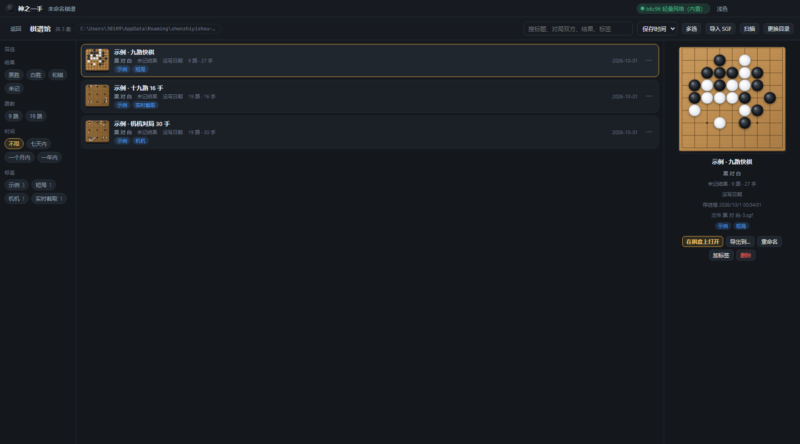
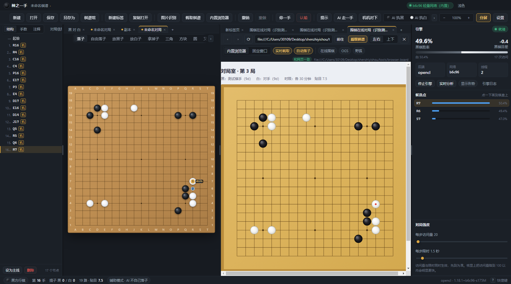
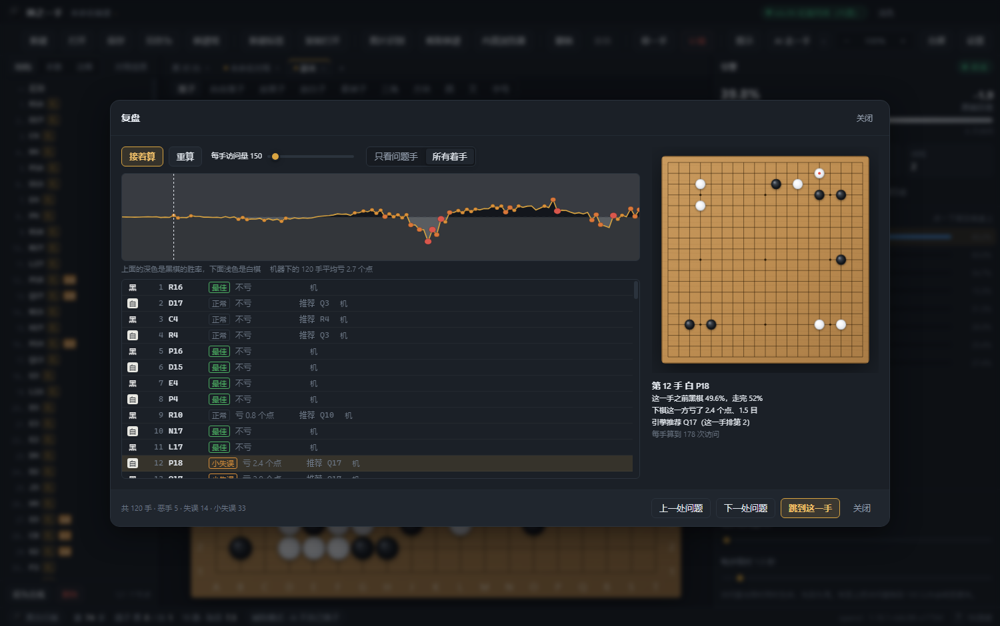

<div align="center">



<a href="https://github.com/shimiei/shenzhiyishou/releases/latest"></a>   

</div>

# 神之一手



自带 KataGo 引擎与网络，装完就能下。棋谱是普通的 SGF，落子、提子、自杀、打劫、超级劫、数子都按规则算；变化图、注释、各类标记按完整 SGF 编辑。

它主要能做这几件事：

- 和 AI 下：辅助（只提示、不替你落子）、人机对局、机机对局三档，随时可切。
- 看棋：实时分析给胜率、目差和候选点；复盘把一整局逐手算一遍，把恶手挑出来。
- 收棋谱：棋谱馆就是一个装满 `.sgf` 的文件夹，外加一份索引，可搜、可筛、可打标签、可批量导出。
- 捡棋谱：从图片识别；或者用内置浏览器、固定窗口盯着网页和对家客户端，把棋跟着接过来，也能把你在程序里落的子点回去。
- 多盘同时开：棋盘标签，每盘各管各的棋谱、分析、复盘与对局设置。

Windows 10 / 11 x64，MIT 许可。用到的第三方组件与许可写在文末。

## 目录

- [下载与安装](#下载与安装)
- [四项已确认的取舍](#四项已确认的取舍)
- [环境与命令](#环境与命令)
- [引擎与网络从哪来](#引擎与网络从哪来)
- [引擎与网络](#引擎与网络)
- [窗口](#窗口)
- [分栏](#分栏)
- [多个棋盘](#多个棋盘)
- [棋谱馆](#棋谱馆)
- [内置浏览器](#内置浏览器)
- [固定窗口：认程序外面的窗口](#固定窗口认程序外面的窗口)
- [操作](#操作)
- [当辅助用，还是当对手用](#当辅助用还是当对手用)
- [复盘](#复盘)
- [代码结构](#代码结构)
- [运行数据放在哪](#运行数据放在哪)
- [第三方组件与许可](#第三方组件与许可)
- [已知限制](#已知限制)

## 下载与安装

到 [Releases](https://github.com/shimiei/shenzhiyishou/releases) 拿最新一版：

| 文件 | 说明 |
| --- | --- |
| `shenzhiyishou-0.1.1-x64.exe` | 安装版，约 95 MB。装上之后有开始菜单和桌面快捷方式，会跟系统一起右键菜单的那些东西无关，就是个普通的单机程序。 |
| `shenzhiyishou-0.1.1-portable.exe` | 便携版，双击就跑，不写注册表，放 U 盘里也行。 |

发布页上的文件名只能用英文和数字，中文会被它抹掉（`神之一手-便携版-0.1.1.exe` 传上去成了 `-.-0.1.1.exe`），所以放在发布页上的这两个文件是英文名。`npm run dist` 在本地打出来的仍然叫 `神之一手-0.1.1-x64.exe` 与 `神之一手-便携版-0.1.1.exe`，装出来的程序也叫神之一手。

- 系统要求：Windows 10 / 11 x64。核显就能跑（默认的 OpenCL 后端），没有独显也开得起来，只是大网络每步要等几秒；另有一个纯 CPU 的兜底后端，核显驱动有问题时顶上。
- 安装包只带小网络（b6c96，约 4.8 MB），大网络在程序里一键下载，所以安装包在一百兆以内，不会变成四百兆以上。
- 第一次打开要等一会儿（引擎面板上滚着调优进度），见下面「首次启动会慢，这是正常的」。这段等待里界面是活的，别以为卡死了。
- 卸载就是普通卸载。棋谱、设置和下载下来的网络留在用户目录里，不跟着删，重装之后接着用（见「运行数据放在哪」）。
- 想自己编译，见下面「环境与命令」；仓库里不带引擎二进制和大网络，那两样得自己补（见「引擎与网络从哪来」）。

## 四项已确认的取舍

1. 打包只带小网络（b6c96，约 4.8 MB），大网络在程序里按需下载。安装包因此在一百兆以内（实测 95 MB），不会变成四百兆以上。
2. 图片识别以本地离线识别为主，另留了视觉大模型接口，填了地址和 key 就能用。
3. 内置浏览器只做通用截图识别，不对某个网站做专门适配。
4. 棋谱编辑器按完整 SGF 做，支持变化图、注释、各类标记。

## 环境与命令

需要 Node 18 以上，Windows x64。

```
npm install          # 装依赖
npm run typecheck    # 主进程与渲染进程各类型检查一次
npm run build        # 编译主进程，打包渲染进程
npm start            # 编译后直接启动（开发用）
npm run dist         # 出安装包和便携版，产物在 release/
```

图标由 `python tools/make-icon.py` 生成，改了图要重新跑一次。README 顶上那张题图是 `tools/make-banner.ps1` 画的（Windows PowerShell 直接跑，配色照抄程序主题，字体用 Noto Serif SC 与 Microsoft YaHei UI），改完也重新跑一次。

自测脚本，改完规则、识别算法或窗口逻辑先跑一遍：

```
npm test                      # 下面五份自测一起跑
npm run test:rules            # 规则引擎：落子、提子、自杀、劫、超级劫、数子、坐标
npm run test:window           # 窗口尺寸与位置：居中、越界拉回、换屏幕、副屏更小
npm run test:ui               # 棋盘标签、切片清单完备性、会话往返、标签页规则、地址栏输入、分栏夹取、送去引擎的局面、复盘算分、双停终局
npm run test:cv               # 棋盘识别：自己画几种风格的棋盘，看黑白子认不认得对
npm run test:winhelper        # 助手脚本：那几段 PowerShell 真写成文件、真编译、真跑一遍（只读，不碰鼠标）
npm run test:engine           # 真引擎复验：每一份局面 loadsgf 后盘面与行棋方都对得上
node tools/gtp-selftest.mjs   # 真引擎链路：启动、loadsgf、落子、分析
node tools/cv-check.mjs 图片 --answer 答案.sgf   # 图片识别的准确率回归
```

规则引擎那份自测有 70 项断言，窗口 37 项，界面逻辑 544 项，棋盘识别 39 项，助手脚本 19 项（其中"拒点时光标一个像素没动"那一项量的是差值，鼠标正被人动着的时候会记成待验、不判失败），都能直接 `node tools/rules-selftest.mjs`、`node tools/window-state-selftest.mjs`、`node tools/ui-logic-selftest.mjs`、`node tools/cv-selftest.mjs`、`node tools/winhelper-selftest.mjs` 跑。它们存在的理由很实在：这类错不会让类型检查报错，只会让程序悄悄下错棋、开出一个拖不动的窗口、关掉标签跳到别的页面上、把上一盘的评点扣到这一盘上、重启之后少开一盘棋、把一局棋存成两份、或者悄悄少认一半白子。最后那一套专盯那几段交给 PowerShell 现编现用的脚本：C# 里写错一个词、鼠标动作挪到守卫前面，类型检查与其它自测都看不见，它会真写文件、真编译、真跑一遍，只是不做需要屏幕的那一步。`test:engine` 要开真引擎，二十多秒，所以不在 `npm test` 里。

跑起来的实例也能从外面看：`node tools/devtest.mjs --remote-debugging-port=9223` 起一个独立配置的验收实例，再用 `node tools/live-probe.mjs "<表达式>"` 在它的界面里求值，截图和点击见 `tools/cdp.mjs`。

这几个工具挑的永远是 `index.html` 那个页面目标（`tools/app-target.mjs`）：固定窗口那一档会多出一个落点叠层窗口，它也是 `file:` 页面目标（`overlay.html`），标过一次点就一直在，按“第一个页面”“第一个 file:”去挑就会挑到它上面，报出来是一句莫名其妙的 `Cannot read properties of undefined`。

目录下 `docs/shots/` 里这几张图不是画出来的，是 `node tools/shots.mjs 9223` 让一个开发实例真跑一遍拍下来的：演示棋局由引擎自己下，棋谱馆那几盘是真的存进去的，实时截取那张是程序真的在往网页上点。换了界面重跑一次就能刷新，别让 README 挂着旧版的样子。这个脚本要实例带 `--disable-gpu` 起（`node tools/devtest.mjs --remote-debugging-port=9223 --disable-features=CalculateNativeWinOcclusion --disable-gpu`）：本机走显卡合成时画面那一路取不到帧，`Page.captureScreenshot` 会一直挂着不返回，拍出来的图跟显卡无关，软件渲染就够。

打包之后想验真正打出来的那一份：`npm run dist` 之后跑 `node tools/pkgtest-refresh.mjs`，它把 asar 解一份到 `%LOCALAPPDATA%\Temp\szys-pkg`，只改用户目录那一行的名字，于是那份副本和用户正在用的安装版可以同时开着，互不干扰。有一处坑得记住：Electron 是先认 `resources/app.asar`、其次才认 `resources/app` 目录，所以脚本会把副本里那份旧 asar 删掉，不然改过的 main 根本不会被加载，跑出来的还是上一版的代码、用户目录也还是正式那个（第一版脚本就是这样，验收量完才发现量的全是旧版本，脚本现在自己会拦这一条）。

按真界面点击走的验收驱动有三份，都要一份能连 CDP 的实例：

```
node tools/library-accept.mjs 9223      # 棋谱馆 80 项：存两次落在同一条、另存为、导入、搜索排序筛选、
                                        # 重命名与标签、单份与批量导出（回到磁盘上核对文件）、批量删除、
                                        # 扫描收编、换目录搬移、关了再开归属还在
node tools/nudge-accept.mjs 9223        # 工具条左右推 21 项：窄窗口下溢出、箭头、滚轮、选中自动进视野
node tools/autoplay-accept.mjs 9223     # 自动落子 57 项：点完之后焦点还在程序里、网页挪位后照样认得出来、
                                        # 点不上不再自动关开关、AI 固定执一方并真的自己走，外加
                                        # 点出去没落上的四条：没接住的会重点一次、那边画得慢的不会重复点、
                                        # 一直没落上的点三次就停并如实交代、那边换了别的子就不点了按那边重新对
```

验装机版副本时，端口换成 9444，加上 `--exe=%LOCALAPPDATA%\Temp\szys-pkg\神之一手.exe --seam`；`nudge-accept` 与 `autoplay-accept` 没有重启那两段，给端口加环境变量 `SZYS_WIN_PATH=szys-pkg` 就够了（它们按路径挑窗口，不会动到用户自己开着的那一份）。`--seam` 指的是那份程序起的时候带了 `SZYS_TEST_PICK`：主进程里留的验收口子，把"另存为 / 导出 / 换目录 / 打开棋谱"这几处系统对话框的返回值直接给出来，省得驱动去操作系统对话框。它只认这一个环境变量，没设的时候一行都不会走到。

### 开发时想同时开着两个实例

正式程序把用户目录钉死在 `%APPDATA%\shenzhiyishou`，单实例锁也在那里，所以开发实例会被你自己正在用的那份踢掉。要并排跑一个用于验收的实例：

```
node tools/devtest.mjs --remote-debugging-port=9223
```

它把编译产物复制一份，只改用户目录名，其余代码一字不差，于是两个实例互不干扰。`tools/probe-window.ps1` 是配套的窗口探针，可以打印窗口样式位、位置、DPI，也能模拟拖动、最大化，还能用 WM_NCHITTEST 问系统"这条边上按下去算不算缩放边框"。

`tools/browser-board-test.html` 是给"内置浏览器截取棋谱"用的固定测试页：一页 19 路棋盘，摆着一组写死的黑白子。在程序里用它打开这个页面、按"截取棋谱"，识别结果应当正好是 19 路、黑 12 白 12。几个查询参数：`?style=yike` 换成另一种客户端的样子（亮橙木色、蓝格线、白子是灰球面，格线还压在棋子上层，白子最难认的就是这一种），`?px=320` 把棋盘钉小，分屏矮的时候靠它把整块棋盘塞进画面，`?start=empty` 从空盘开局，`?bare=1` 只留棋盘（把标题、比分那几行藏掉）。

这一页也能下棋：点棋盘的交叉点就落一子（轮到谁落谁的，落在有子的地方不生效），“对手走一手”按钮或者在页面里调 `window.__opponentMove('Q16')` 就是对手走棋，`window.__state()` 能读出当前手数、落子记录和点击记录。验收实时截取和自动落子就是靠它跑真点击、真截图。想离线核对，就把这页的截图配 `tools/browser-board-answer.sgf` 喂给 `cv-check.mjs`：

```
node tools/cv-check.mjs 截图.png --answer tools/browser-board-answer.sgf
```

## 引擎与网络从哪来

随包的小网络（b6c96，4.8 MB）在库里，克隆下来就能直接打包。引擎二进制和大网络不在库里：加起来一百三十多兆，而且都能公开下载，已在 `.gitignore` 里排除。自己补上这两样：

```
engine/katago.exe            从 https://github.com/lightvector/KataGo/releases 取 v1.18.1 的 win64 版
engine/opencl/               上面那个包解压出的 dll 目录
engine/eigenavx2/            同上，纯 CPU 兜底后端
models/kata1-b18c384nbt-s9996604416-d4316597426.bin.gz   最强网络，93 MB
```

大网络不一定非要现在下：程序里"设置 → 引擎与网络"能一键下载 b18c384nbt 和 b28c512nbt，下载地址写在 `src/main/models.ts` 的 `MODEL_DEFS` 里。新机器上只有小网络时，程序会自动退回小网络启动并在日志里说明。只有想让安装包自带大网络，才需要手动放进 `models/`，同时改 `electron-builder.yml` 里 models 那段的过滤规则。

## 引擎与网络

引擎是 KataGo v1.18.1。v1.18.2 只有 CUDA 版，本机没有独显，用不上。程序里带两个后端：

- opencl：走核显，默认用这个。
- eigenavx2：纯 CPU 兜底，核显驱动有问题时可以顶上。

网络方面，随包只带 b6c96（`models/b6c96-s175395328-d26788732/model.txt.gz`）。设置里能下载 b18c384nbt 和 b28c512nbt，也能从磁盘导入自己手上的网络文件。



换网络分两步，界面上写得很直白。"设为默认"只是改设置，正在跑的引擎不会当场换（换引擎要把进程停掉、把网络重新读进来，大网络在核显上要十几秒）；之后下一次启动引擎或开始分析时，程序发现网络和正在跑的不一样，会自己把旧的停掉换新的，并在引擎日志里写一行。想让引擎立刻换，用"引擎与网络"里的"立刻换成这个网络"。这段时间里引擎面板上的网络名显示的是引擎真正加载的那个，下面会有一行小字说明已经换成哪个、下次启动时生效。



### 首次启动会慢，这是正常的

程序启动时会自己把引擎拉起来（面板上显示"启动中"），不用去点"启动引擎"。调优缓存已经存在时，从拉起进程到 GTP 就绪大约 21 秒（b18c384nbt，OpenCL）。

第一次运行没有这个缓存，OpenCL 后端要针对你的显卡搜索并编译内核参数，KataGo 会打印几十行 Tuning 进度。这一步在本机实测约 6 分钟（随包的小网络，核显），是程序第一次打开要等的最长时间；之后结果缓存在运行目录里，第二次启动就快了。这段等待期间界面是活的，引擎日志面板会一直滚进度，不要以为卡死了。不想让它占着显卡，随时可以在引擎面板上点"停止引擎"，下次要用时它会自己再起来。

另外，新装的机器上只有随包的小网络，而设置里默认指向大网络，这时程序会自动退回小网络启动，并在引擎日志里写一行说明。想用大网络在"引擎与网络"里下载即可。

实时分析用的是第二个引擎进程（和落子分开，免得抢显卡）：点"实时分析"时它才起来，第一次同样要十几秒。这段等待在界面上是看得见的：引擎面板的徽章会写"分析准备中"，候选点那一栏也会说明"分析引擎正在启动，核显上通常十几秒"，引擎日志里另有一行"[分析] 正在启动分析引擎"。启动完这两处就变成"分析中"和候选点列表。分析已经在跑的时候再改局面，重启分析几乎是立刻的，不会每次重新等。

分析跑着的时候落一手，胜率、目差、候选点和棋盘上的形势不会先空一下再填回来：上一个局面的那条结论原地留着，新局面的结论一到就整体顶替。KataGo 第一条结论来得很快（几十毫秒就有胜率，之后慢慢变准），所以这个过程基本看不出停顿。留着的这一小段时间里，面板上的数字和候选点属于上一个局面，因此那几行点了不会画推荐圈，等新结论到了再点才作数。关掉实时分析、或者在分析关着的时候改动局面，这些数字仍然会立刻清空，不会挂着旧局面的结论。

### 送去引擎的局面长什么样

KataGo 的 `loadsgf` 只认根节点上的摆子：第二个节点往后只要出现 AB / AW / AE，整谱会被拒收，报 "Found stone placements after the root"。而这个程序允许把摆子写在任意节点上（摆子工具改的是当前节点，从图片"接到当前谱后续"会另起一个只有摆子的节点），所以每次送引擎之前会把整条路径上的摆子收拢进根节点，并在根节点写上 `PL` 把轮次钉死。

轮次要写死是因为：根节点上只有摆子、没有手数时，KataGo 按让子惯例算白走，而界面按"没有手数就是黑先"来显示，不写 `PL` 两边会差一个回合（实时分析会把白方的候选点当成黑方的报给你）。收拢完的程序会用自己的解析器把这份 SGF 读回来，跟界面上的盘面逐点比一遍，改动了就不认，改发"纯局面"（根节点直接列出每一颗子，不带手数）。极少数情况下会走这条退路，比如某一步被 `AE` 拿掉的是前面某一手下的子，这种没法只用根节点表达。

`npm run test:engine` 会把这几类局面逐条喂给真引擎，比对盘面和行棋方。

提示和落子用的是同一个引擎进程，参数上有两个坑已经踩过并修掉，写在 `设计草案.md` 的"已知事实备查"里：`maxTime 0` 不是不限时而是立刻停（会交出一个只有一次访问的结论），以及 `kata-genmove_analyze` 会把这一手落到引擎自己的棋局上，所以每次之后"已经同步过"的缓存都要作废。提示本身按分析的访问量算，但带一个时限，用的是设置里"每步限时"那一档，默认 3 秒，到点就交现有结论，不会让你对着转圈等几十秒。

### 从内置浏览器截取棋盘

截取的是当前画面，所以整块棋盘得先进画面。分屏窄到放不下棋盘时，程序不会硬猜一个路数出来，而是直接告诉你"棋盘被画面裁掉了一部分"。这时在网页里按 Ctrl 和减号把页面缩小，或者拖分屏把浏览器那侧拉宽，再截一次。

### 性能预期

本机是 Intel Iris Xe 核显加 16 GB 内存，没有独显。b18c384nbt 有约 2630 万参数，在核显上每秒几十次访问，所以用大网络对局时每步要等几秒，默认按每步 3 秒左右控时。想又快又强需要独显，这是硬件门槛。小网络 b6c96 快得多，适合随手摆棋和试手。

程序在设置里能测速，也会在启动时挑可用的后端。

## 窗口

窗口是无边框的，标题栏由程序自己画，窗口按钮是系统画在最右上角的那一组。

第一次打开是 1500×950 居中。之后你拖成什么尺寸、放在哪，都会记在设置里，下次按这个尺寸开；上次是最大化退出的话，下次也最大化。记下来的尺寸每次启动都会对着当前屏幕再夹一遍：换了显示器、拔了副屏、改了系统缩放，窗口也不会跑到看不见的地方，更不会开得比屏幕还大。

最小尺寸是 960×620。

`视图` 菜单里还有三个窗口命令，窗口万一被拖乱或卡在最大化状态时用：最小化、最大化与还原、恢复成 1500×950 并居中。这组按钮是系统的，也在最右上角。

## 分栏

左栏、右栏、棋盘与浏览器之间各有一条分隔条，都可以拖，拖的时候光标旁边跟着一个尺寸（棋盘与浏览器那条写的是两块各有多少像素，窗口那两条写像素宽度），双击分隔条复位。宽度和分屏比例都记在设置里，下次打开还是这样。分隔条中间有一截看得见的小把手，鼠标移上去整条亮起来，它不是一个看不见的 5 像素。

棋盘和浏览器有两种排法，在浏览器栏的 `左右` / `上下` 上切：

- `左右`：棋盘在左、浏览器在右，分的是中间那一块的宽度。
- `上下`：棋盘在上、浏览器在下，分的是高度。

为什么要有上下这一种：浏览器是满高的，窗口不宽的时候左右分栏摆出来永远是竖着的一条窄缝，网页会按手机版排。换成上下分栏，浏览器直接拿到整条中间宽度，才像个正常窗口。还没自己选过方向时程序按窗口挑一个：左右分栏摆出来的浏览器要是比它自己还高，就用上下分栏；选过一次之后就听你的，不再自动改。

窗口不够宽时按空间自动压：棋盘至少留 300 像素，浏览器那侧至少 320 像素，左栏不低于 214，右栏不低于 240。上下分栏时保底的是高度：棋盘那块 320，浏览器那块 300（它自己的标签栏、地址栏、预设按钮就要吃掉一百来像素）。压下来只是显示上的事，你拖出来的尺寸还记着，窗口一拉大就回去了。浏览器栏窄的时候会自己收东西：先收掉能用回车替代的"前往"，再收预设和关分屏的叉，把地方让给地址栏。

拖分隔条的时候会盖一层透明的全屏遮罩。内置浏览器是网页控件，指针一进它的范围就被页面自己接走了，不盖遮罩拖动会卡在半路；遮罩顺带挡住拖动时棋盘跟着高亮、文字被选中这类杂音。分隔条本身只有 5 像素宽，往两边各借了 4 像素当热区，免得一偏就点空。

## 多个棋盘

棋盘可以开多盘，标签条排在棋盘上边，用法和浏览器标签一样：点一下切换，中键或标签上的叉关掉，尾巴上的加号开一盘空的。只有一盘棋的时候这条自己收起来，不占地方。

新的一盘从哪来：

- 工具条上的 `新建标签`，或者按 Ctrl+T。
- `新建对局`（Ctrl+N）、`打开棋谱`（Ctrl+O）、图片识别里的"新建棋谱"，都落在新标签里；图片识别的"接到当前谱后续"仍然接在当前这一盘上。
- 工具条上的 `复制打开`，或者按 Ctrl+Shift+D：把当前这一盘整棵棋谱复制到新标签，分支、复盘结果、对局设置都带着，落点也停在同一个节点上。副本算一份新棋谱（文件名清空、标着未保存，不会盖掉原件），撤销历史不带过去，所以复制完两盘各走各的。

每一盘各管各的：棋谱与分支、当前手、未保存标记、文件路径、对局设置（对弈方式、访问量、贴目、让子）、复盘结果、分析结论，都是分开的。分析、复盘、机机对下也一样，切到别的盘不会把它们停掉，标签上挂一个小角标写着这盘正在干什么（分析 / 复盘 / 机机）。

关掉带未保存改动的标签会先问一句：保存并关闭 / 直接关闭 / 取消。`关闭其他` 与 `关闭全部` 会先把"有 N 盘没保存"说清楚再动手。棋盘上总得留一盘，最后一盘关不掉；关错了的用 Ctrl+Shift+T 开回来。

切标签的快捷键：

| 快捷键 | 动作 |
| --- | --- |
| Ctrl+T / Ctrl+W | 新建 / 关闭当前棋盘标签 |
| Ctrl+Shift+D | 复制打开当前这一盘 |
| Ctrl+Tab / Ctrl+Shift+Tab | 下一个 / 上一个棋盘标签 |
| Ctrl+1 到 Ctrl+9 | 跳到第 1 到第 9 个标签 |
| Ctrl+Shift+T | 开回刚关掉的那一盘 |

这一套按焦点分流：焦点在界面里（棋盘、左栏、工具条）管的是棋盘标签，焦点在内置浏览器的网页里管的是浏览器标签页。菜单里"棋盘标签"和"视图"两栏各有一份命令，看不清焦点在哪就从菜单点。

分析引擎一次只服务一盘。在一盘上开着实时分析，切到另一盘再点分析，前边那盘的分析会停下，被顶掉的那盘收到一句说明，标签上的角标跟着灭。复盘和机机对下占了引擎也会顶掉实时分析，提示里会说清是顶掉了哪一盘。这是引擎的物理限制，不是能调的地方。

关掉程序再打开，这一批棋盘按原样回来：标签顺序、当前是哪一盘、每盘的棋谱与落点、没保存的改动、文件路径、对局设置都在（存在 `%APPDATA%\shenzhiyishou\session.json`）。分析、复盘、机机对下不自己接着跑，那几个是动手才开的。

## 棋谱馆

棋谱馆就是你挑的一个文件夹，里面是普通的 `.sgf` 文件，再加一份 `library.json` 记标题、对局日期、结果、标签这些索引。文件名按标题起（`柯洁 对 朴廷桓 2024-03-05.sgf`），撞名自动加序号。都是普通文件，别的程序打得开，丢进网盘就能同步。



默认目录是 `%APPDATA%\shenzhiyishou\records`，从前"存入棋谱库"的那些棋谱原样在这儿。目录可以换：设置里与棋谱馆页面上都有 `更换目录`，换的时候会问一句要不要把现有的棋谱一起搬过去（搬是复制完再删原件，跨盘也安全，中途出错就留在原地并在提示里说清）。

保存不再弹对话框。`保存`（Ctrl+S）直接存进棋谱馆，标题默认是"黑 对 白 日期"；从馆里打开的那一盘再按保存是更新原来那条，不会越存越多（每盘记着馆里的编号，跟着标签走，重开程序也在）。想存一份随手能拿走的散装 `.sgf` 用 `另存为`（Ctrl+Shift+S），那才弹系统对话框。

棋谱馆是一整页，Ctrl+L 或者工具条上的 `棋谱馆` 进去，存完棋的提示里也有入口；Esc 或左上角 `回棋盘` 回到棋盘，原来的局面一点不变。

- 顶栏：共几盘、目录路径（点一下在资源管理器里打开）、搜索（标题与对局双方）、排序（保存时间 / 对局日期 / 手数 / 标题）、多选、导入 SGF、扫描、更换目录。
- 左栏：按标签、结果、路数、时间筛。
- 中间：每行一张小棋盘（按需读盘，滚到哪读到哪，不一次读全部）、标题、黑 对 白、结果、日期、手数 / 路数、标签。行尾 `⋯` 是：打开、导出到…、复制 SGF、重命名、加标签、删除、打开所在文件夹。
- 右栏：选中那盘的预览与对局信息。
- 多选：勾选框、Shift 连选、Ctrl 加选、全选；选中之后顶栏浮出 `已选 N 盘` 与 `导出到…`、`删除`、`取消`。

手动丢进目录的 `.sgf` 用 `扫描` 收编：读文件头认出双方、日期、结果、手数、路数，补进索引；索引里有、文件没了的标成"已丢失"，可以清掉索引那一条。重命名只改馆里的标题，不动磁盘文件名，免得文件被别的程序占着改不动；导出时才按标题生成新名字，同名不覆盖、自动加序号。删除是硬删，先弹确认并说清几条，删了就找不回来，不做回收站。

## 内置浏览器

分屏里的浏览器是多标签的：标签栏上能新建（＋）、关闭（×，中键也行）、切换。每个标签一份独立页面，切走再切回来不会重新加载，正在下的那盘棋还在。

网页里点 target=_blank 的链接、或者网页自己 window.open 的时候，会在同一个分屏里开成一个新标签，不再弹出独立窗口，所以开着几个页面都能截取。截取棋谱认的是当前标签，不是第一个打开的页面。

标签快捷键：Ctrl+T 新建，Ctrl+W 关闭，Ctrl+Tab / Ctrl+Shift+Tab 切换。这几条只在焦点落在网页里时管浏览器标签，是主进程在网页那一层接的按键；焦点在界面里时同样的键管的是棋盘标签（见上一节）。Ctrl+W 被 Chromium 吃掉的那段历史过去了，现在它和从前的 Ctrl+Shift+W 都能关标签页。

“截取棋谱”认的是可见画面，棋盘得整块进画面：分屏太矮或网页棋盘太大时，先拉宽分屏、切成上下分栏，或者把网页缩小（Ctrl 加减号）再截。

### 实时截取：把网页上的棋跟着接过来

浏览器栏上有两个开关，默认都关着。



“实时截取”开着的时候，程序每隔两三秒截一次当前标签的网页画面，认出上面的棋盘，跟本地这盘棋比一比（自动落子也开着的时候会跟紧一点，1.2 秒一拍：两边得一模一样才点得出去，本地落后一手就会白点一次）：

- 一模一样：状态行写“和网页一致”，什么都不做。
- 网上刚好比本地多一手：这一手接到谱上（提子、打劫都算得对，因为是把本地局面挨个空点试着下过去比的，不是数棋子）。状态行写“接上网页的一手：Q16”。
- 差得不止一手：只报差在哪（“网页上多 2 颗，本地多 0 颗”），本地棋盘一颗子都不动。可能是你在网页上看的是另一盘棋，也可能是识别漏了一颗，这两种情况都不该替你改棋。
- 轮次对不上（比如轮到黑走、网页上却多一颗白子）：也按对不上处理，不硬接。

这条规则是故意的：少接一手最多你手点一下，接错一手会让整盘棋跟着错下去，而且很难看出来是从哪一手开始错的。

自动落子点出去、但当场没核实的那一手，也走这里“重新对一次”：那一手还压在手里的时候，实时截取不会拿“本地多一颗”去念它（那本来就是那一手造成的），而是先按上面那三条把这一手办完。

网页棋盘得完整、而且够大地出现在浏览器那一块里才能认出来，认不出时状态行会说原因，并且告诉你怎么办：网格都找不着就是棋盘太小（把分隔条往棋盘那边拖，让浏览器那块大一些，或者在网页里按 Ctrl 加号把棋盘放大），说"被画面裁掉了一部分"就是没放全（用 Ctrl 减号缩小网页，或者改用上下分栏）。第一次认出棋盘之后，程序会记住棋盘在画面里的位置，之后先按这一块去认；网页挪了位置（弹出一条消息、多一行手数或比分）时这一块会对不上，它会拿整幅画面重认一遍，不会一直报"认不出"。

顺带一句：分屏是横着切开的（上下分栏），浏览器那块容易又宽又矮，棋盘按高度缩得很小，这种摆法下实时截取多半认不出来；切成左右分栏，或者把分隔条往上拖，棋盘就有地方了。

### 自动落子：把程序里落的子点回网页

“自动落子”开着的时候，在本程序里落的子会真的点到网页棋盘上（点一下就是落子，和手点一样）。规则有几条：

- 只点本程序里产生的棋：你自己点的、AI 走的。实时截取从网页上读回来的那一手不会再点回去。
- 点之前先截一次，确认网页上还是“这一手之前”的局面。对不上就不点，状态行说明原因。这是防止你在网页上看的是另一盘棋时，手一抖替对手往别人的棋盘上落子。
- 点完连着截几拍核对，一共看一秒多：只要点的那一点上出现了棋子就算点上了（颜色读错也算，读错颜色是常有的事）；这几拍里网页上还是原样，才说“没落上”；网页上变了、但不是你点的那一点，说明点歪了；这几拍都没认出棋盘，就照实说不确定，别硬下结论。
- 这几拍没等到那一手，不会只丢一句“那边没渲染”就完事。程序会把这一手记下来，过一会儿再看一眼两边的棋盘：那边已经和本地这盘一样了，就说明其实落上了，不再点（那一格上已经有子，再点也变不出别的来）；那边还停在点之前的局面，就说明这一下真没点进去，就着同一点再点一次；两样都不是（点歪了、那边别人在动、或者根本不是这盘棋），就不点了，按那边的局面重新对一次。每 1.5 秒看一回，最多点 3 次、最长 30 秒，到点就停——那边要是打不开，点十几次没有意义。
- 停了以后本地这一手留着，不会替你删。实时截取下一拍会比出“本地多一颗”，那句提示会点明多的大概就是没落上的那一手（“点了 3 次那边都没出现”），并说清怎么办：在那边补上这一手、或者把本地这一手撤掉，两边就回来了。
- 核对不通过不会再把开关自己关掉。从前它会悄悄关掉，于是“明明点上了却说没点上”还外加一条“用着用着自己停了”。现在开关保持原样，点了几次、停在哪儿，状态行里都写着。
- 这一手还没核实的这段时间里，你要是又下了一手，程序会先把上一手办完（该重点的重点），办不下来就只提示、这一手先不点，不会把两边的差越拉越大。
- 程序记得上一次找到的棋盘框，下一次先按它去认。网页挪了位置（多出一条横幅、手数栏、比分栏）时，记住的框对不上了，它会拿整幅画面重认一遍，而不是直接报“认不出”。
- 点完之后键盘焦点留在程序自己这边，不会跟着那一下点击跑进网页里。注入的点击本来会把焦点带给网页，程序点完会把它还回来。
- 停一手没法自动点，状态行会提醒你在网页上自己点。

想让它省心，两个开关一起开：对手在网页上走，实时截取帮你接过来；你在程序里想一手、或者让 AI 走一手，自动落子帮你点过去。只开自动落子、不开实时截取的话，网页上对手那一手接不回来，两边会越走越对不上，所以这时开自动落子的提示里会顺带说一句。

识别黑白子看的不只是亮度。有的客户端把木色画得很亮、白子画成带明暗的灰球面，白子整圈取样的亮度跟木色差不多甚至更低，只按“比底色亮”找白子会一颗都找不到（实测过：木色亮度 200、白子 190）。所以底色本身有色（彩度够高）时，还认一条“掉了色”：整圈取样过半是没有颜色又不暗的像素，就是白子；底色没什么彩色时（打印图、浅底棋盘）这条路自动关掉，还是按亮度认。取样圈会跟格线相交、边线上的子还有一角落在盘外，这两类像素先划掉再算，免得被线色和边距带偏。

## 固定窗口：认程序外面的窗口

内置浏览器那一档认的是网页画面。这一档认程序外面的一个窗口：原生的围棋客户端、远程桌面里的画面、别的程序开着的棋谱窗口都行，只要在屏幕上看得见。

在浏览器栏最上面那排切到“固定窗口”，接下来几件事都在下面那块画面预览上做：

- 选窗口：点“选窗口…”，列表里列的是当前屏幕上看得见的窗口（自己这个程序不列）。挑那个下棋的。程序按进程名记着它（窗口标题会随对局变，进程名不会），下次打开这一档自动接回来；窗口关掉、最小化了都读得到，状态行会说。
- 认一下：认出棋盘就把路数和子数写在按钮旁边，预览上描出识别到的棋盘和棋子。
- 框选：认不出来的时候，在预览上按住拖一个框把棋盘圈进去，之后一直按这块认。存的是比例，所以窗口挪位置、换大小，甚至远程画面被缩小显示，框都还成立。旁边那个按钮把框去掉。
- 标一下：把当前这一手（没有就拿天元）在那个窗口上画一个环，你一眼能看出程序算的位置对不对。
- 落点提示：这个开关开着的时候，每次真点之前先在那个位置画一个环。

认出来的棋跟网页那一档走同一套流程：实时截取会把窗口里多出来的一手接到谱上，自动落子会把你落的子真点到那个窗口里。区别只在最后那一下：网页那边是往 webview 里注入点击，这边是真的移动鼠标点过去。

真点这一下有守门：点之前先核对画面比例跟窗口现在的比例对不对得上（你正拖着窗口边缘改大小的时候，画面还是旧尺寸，这一拍就不点，下一拍重新认过再点），再核对那个屏幕像素点上最上面的是不是目标窗口（是不是目标进程的），不是就一个都不点，状态行会写明“那一点上盖着别的窗口”。点完把鼠标挪回原处，键盘焦点也还给你原来那个窗口。所以目标窗口被别的窗口完全压住的时候，它不会硬点。

多屏、系统缩放、远程画面里的缩小显示都不影响落点：量窗口和搬鼠标都交给一个先把自己标成“每显示器 DPI 感知”的助手进程，量到的和点到的都是同一套物理像素，中间全靠比例换算，最后换算成界面坐标那一步交给系统。

## 操作

菜单栏和快捷键都完整，常用动作一只手能完成。

| 快捷键 | 动作 |
| --- | --- |
| 左右方向键 | 上一手 / 下一手 |
| 上下方向键 | 回到开局 / 跳到末尾 |
| Ctrl+Z / Ctrl+Y | 撤销 / 重做 |
| Ctrl+S / Ctrl+Shift+S | 保存进棋谱馆 / 另存为散装 .sgf |
| Ctrl+L | 打开棋谱馆 |
| 空格 | 让 AI 替现在行棋的一方走一手 |
| P | 停一手 |
| H | 提示一手（标明黑白，不落子） |
| A | 开关实时分析 |
| M | 开或停机机对局（双方都由 AI 自动走） |
| R | 打开复盘 |
| E | 形势判断与数子 |
| B | 开关内置浏览器 |
| Ctrl+T / Ctrl+W | 焦点在界面里：新建 / 关闭棋盘标签；焦点在网页里：新建 / 关闭浏览器标签页 |
| Ctrl+Shift+D | 复制打开当前这一盘 |
| Ctrl+Tab | 切换标签（界面里切棋盘标签，网页里切浏览器标签页） |
| I | 从图片导入 |
| C / N | 开关坐标 / 手数 |
| Delete | 删除当前节点 |
| ? | 快捷键一览 |

右键或 Shift 单击交叉点，在数子界面里是切换死子标记。

工具条上的按钮放不下的时候会收成能左右推的一排：两头出现 `‹` `›`，在排上滚一格滚轮也能横着推，刚选中的那件总是自己留在看得见的地方。窗口窄、右边又开着内置浏览器时，落子工具那一排（`圆` `叉` `字母` 就在最右边）靠这个才够得着。主工具条也一样，它那二十几颗按钮排起来要一千七百多像素，一般窗口放不下，`缩放`、`分屏`、`设置` 那一撮始终钉在右边不跟着推。窗口够宽、一排放得下时，这两个箭头不会出现。

棋盘上画什么在设置里都能调：坐标、手数，以及最后一手的标记。标记有六种可选：异色点、异色圈（黑子上画白点、白子上画黑点）、红点、红圈、红三角，或者干脆不标。异色那两种画得最轻，子多的时候容易看丢；红色那几种不跟着棋子换色，一眼就能找到刚才那一手落在哪。

## 当辅助用，还是当对手用

对弈方式有三档，在"新建对局"里选：

- 辅助：AI 不自己落子。要建议按 H 或点"提示"，它会说清这一手是给黑方还是白方的（"白棋推荐 Q4 · 白方胜率 62.9% · 领先 1.0 目"），棋盘上同时画一个同色的半透明子加金圈，只让你看，不替你走。想让它顶一手就按空格或点"AI 走一手"，走完就停，下一步还是等你。
- 人机对局：AI 自动走你对手那一方。
- 机机对局：双方都自动走，拿来看棋。

机机对局不必非得从"新建对局"开：工具条上的 `机机对下`（或者按 M）随时能开，也随时能停，从当前局面接着往下走，不是重开一盘。状态行最左边那句写着现在的档，点它也一样管用。正算着一手的时候按停，那一手会照常落下，提示里会说清；之后再不会自己走。

只想让 AI 顶一方，就用 `机机对下` 旁边那两颗：`AI 执黑` 和 `AI 执白`。点哪颗，AI 就固定执哪一方，另一方全归你；轮到它的时候它自己走，跟人机对局是同一件事。再点一下同一颗就收回来，回到辅助模式（AI 一手都不自己走），状态行那句话跟着变。两颗都不亮就是辅助模式。开着机机对局的时候这两颗不亮（两边都归 AI，没有"固定执一方"这回事），从 `机机对下` 回到自己下的时候，之前固定执的那一方还会接着留着。这一档不走棋谱文件：棋谱本身仍按 SGF 的规矩记，交给别的程序不会多出一份"谁该走"的人为信息。

于是看完整的一盘棋只要三步：点 `机机对下`，等它下完（中途点 `停机机` 也行），再按 R 复盘。一路走下来的每一手都记着来源是机器，复盘清单里"人 / 机"那一栏看得出来。

搭配使用的一点说明：

- 提示按"现在轮到谁"算，胜率和目差也都是行棋方视角，所以同一句里两个方向一定是同一个视角，不会看串。
- 盘面一变（落子、摆子、撤销）手里的推荐立刻作废，不会留个圈在旧局面的点上。
- 摆子的局面（从图片导入的图、自己摆的开局）没有手数，程序按惯例猜黑先。轮到谁由你说：状态栏那个"换先手"按一下改成白先，之后提示和分析都按新的走。有手数的局面轮次跟着手数走，这个按钮就不出现了。
- 从图片认出来的局面默认落在辅助档，识别完直接按 H 拿建议，不会莫名其妙多出一手。
- 机机对局会自己收尾：两边连着停一手就停，档退回开之前那一档，并打开形势判断，再点 `机机对下` 会说明这盘已经下完了。开着机机的时候去翻前边的棋、撤销、摆子都不会另起一手，要接着自动走就再点一下。

## 复盘

一整局下完（或者从棋谱馆里翻出一盘别人的棋）想知道哪儿下的不好，按 R 或者点工具条上的"复盘"。引擎会把这一局的每个局面挨个算一遍，然后给结论：



- 上方是胜率曲线，深色是黑棋的胜率、下面浅色是白棋，曲线上带颜色的点就是问题手，红点越大亏得越多。点曲线能选中某一手，双击直接跳过去。
- 下面是逐手清单：黑白、手数、坐标、评语（最佳 / 正常 / 小失误 / 失误 / 恶手）、亏了几个胜率点、引擎推荐的那一手，最右边是这一手是谁下的（人 / 机）。默认只列问题手，切"所有着手"能看全部。
- 右边一块小棋盘跟着选中的那一手走，下面写清这一手之前的胜率、亏掉的目数、推荐的着点，以及每手算到了多少次访问。
- 底部左下角是统计：共几手、恶手几处、失误几处，以及人下的手和机器下的手各平均亏多少。工具条上的"上一处问题 / 下一处问题"可以不打开这个窗口就一处处看过去。

分档的界线是亏的胜率点：2 点以内算正常，超过 2 点是小失误，超过 5 点是失误，超过 12 点是恶手；走的就是引擎第一推荐时另算"最佳"。这些数字和坐标换算都在 `core/review/review.ts` 里，纯函数，自测钉着。

两个实现上的取舍：

- 每个局面的访问量在设置里调（默认 150，也能在复盘窗口里直接拖）。一整局几百手，核显上先用 100 到 200，跑得动再加。跑的时候工具条上写着"复盘 12/35"，随时可以点"停下"。
- 结果按节点存，中途停下、程序关掉之前算完的部分都留着：再打开窗口点"接着算"就从断的地方往后跑，点"重算"才从头来。复盘要独占分析引擎，所以它一开始跑，实时分析会停下来；反过来你点实时分析，复盘会让位并在提示里说明，已经算完的部分照样留着。

一盘棋的每一手是谁下的，程序记在 SGF 的自定义属性 `SRC` 里（`human` 或 `ai`）。左侧结构、复盘清单里那个"人 / 机"就是读它，存盘再打开也还在。导入的棋谱没有这个属性，所以不标；这个属性只在本程序内部用，送去引擎之前会摘掉。

## 代码结构

```
src/main/         主进程：窗口、菜单、IPC、GTP 引擎、网络下载、棋谱馆（目录、索引、扫描、导出）
src/main/windowState.ts  窗口尺寸与位置的落地计算（纯函数，可单独测）
src/preload.ts    contextBridge 暴露的 api
src/shared/       两个进程共用的类型与协议
src/shared/records.ts  棋谱馆的纯函数：默认标题、文件名清洗与去重、搜索、排序、筛选、扫描合并、丢失判定
src/renderer/
  core/go/        规则引擎：提子、劫、超级劫、数目
  core/sgf/       SGF 解析与序列化、不可变棋谱树
  core/cv/        图片识别：找棋盘、拟合网格、判定黑白
  core/review/    复盘：逐手亏损、分档、问题手排序、胜率曲线（纯函数）
  core/boards/    多盘棋盘：切片清单、开关闭与切换、复制、会话读写（纯函数）
  core/records/   棋谱馆索引那几栏怎么从一份 SGF 里读出来（纯函数，扫描与收藏共用一处）
  core/browser/   标签页规则、地址栏输入归一（纯函数）
  core/layout/    分栏尺寸的夹取与像素保底（纯函数）
  components/     界面组件
  state/          zustand 状态
tools/            开发自测脚本、验收驱动、README 截图
engine/           KataGo 引擎（opencl 与 eigenavx2）
models/           网络文件
docs/shots/       README 里的界面截图
```

主进程不依赖任何第三方库，只用 Node 内置模块和 Electron，这样打包体积和启动时间都可控。

## 运行数据放在哪

引擎在 Windows 上读中文路径不稳，而且安装目录通常不可写，所以引擎、网络、日志、临时文件都镜像到用户目录：

- 引擎与网络：`%APPDATA%\shenzhiyishou-runtime`
- 设置：`%APPDATA%\shenzhiyishou`
- 棋谱馆（默认目录，可以在设置里或棋谱馆页面上换）：`%APPDATA%\shenzhiyishou\records`，里面是普通的 `.sgf` 与索引 `library.json`
- 关掉时开着的那几盘棋盘（会话）：`%APPDATA%\shenzhiyishou\session.json`

首次启动会把随包的引擎和网络复制过去，之后就一直用这份。

## 第三方组件与许可

本项目以 MIT 许可发布，全文见 [LICENSE](LICENSE)。用到的第三方组件、各自的许可与版权声明另有 [THIRD-PARTY-NOTICES.md](THIRD-PARTY-NOTICES.md) 一份。安装之后这两份都随包放在安装目录的 `resources/licenses/` 里（`LICENSE.txt` 与 `THIRD-PARTY-NOTICES.md`），程序里“关于”那个窗口有指向它们的说明。

| 组件 | 用在哪 | 许可 |
| --- | --- | --- |
| Electron 33 | 桌面外壳，主进程与渲染进程都跑在它上面 | MIT。它体内是 Chromium，那部分的第三方声明随包附带，在安装目录的 `resources/LICENSES.chromium.html` |
| React 18 与 ReactDOM | 界面 | MIT |
| zustand | 界面状态 | MIT |
| KataGo 1.18.1 | 引擎，`engine/` 下 opencl 与 eigenavx2 两份 | MIT |
| KataGo 神经网络 | `models/` 下的网络文件，随包的小网络与程序里下载的大网络 | KataGo Neural Network License（MIT 式，分发时须保留版权与许可声明），个别 g170 系列网络是 CC0 |
| Vite、esbuild、TypeScript、electron-builder | 只在开发与打包机器上跑，不进安装包 | 各自的开源许可，见 `package-lock.json` |

上游都在这里：

- KataGo：<https://github.com/lightvector/KataGo>
- KataGo 网络与许可说明：<https://katagotraining.org/>
- Electron：<https://github.com/electron/electron>
- React：<https://github.com/facebook/react>
- zustand：<https://github.com/pmndrs/zustand>

## 已知限制

- 大网络在核显上每步需要几秒，深度学习分析更慢。
- 图片识别对拍照的透视变形和强烈反光还不够稳，识别结果可以手工点着改，这是设计上就留的兜底。
- 内置浏览器截取的是可见画面，棋盘没完整进画面、或者小到认不出来时会被拒绝识别，得先缩小网页或者把分屏里浏览器那一块调大。实时截取和自动落子用的是同一套识别，同样受这条限制。
- 固定窗口那一档要认得着那个窗口里的棋盘：目标窗口被别的窗口完全压住时，能不能接着抓到画面取决于对方程序，有的程序被判定成“被遮挡”就停画，抓到的是一张黑图。这时程序会如实说认不出，不会乱认更不会乱点，把那个窗口露出来一点就正常了。真点那一下同样要求目标窗口在最上面，被压住的点一律不点。
- 固定窗口认的是整个窗口的画面，窗口里除了棋盘还有一堆按钮和文字，所以多半要用“框选”先把棋盘圈出来再认；框选存的是比例，窗口挪位置、换大小之后不用重框。
- 实时截取最快也就两三秒一拍（自动落子开着时 1.2 秒一拍）：截一张加认一次要两三百毫秒，网页落子之后往往还有动画，截太勤容易拍到没落定的画面。
- 程序自己的窗口被最小化时截网页会一直挂着不返回（要等到有画面才给图），所以这一档当场就不截了，直接在状态行说“程序窗口被最小化了，没有画面”，恢复出来下一拍自己接着看。窗口都收起来了还每拍干等六秒，看着就像同步卡死了。另外，卡住的那一拍也会被清掉：一拍超过 15 秒还没回来，下一拍就重新开始，不会一直停在那上面。
- 视觉大模型识别需要自己填兼容 OpenAI 协议的地址、模型名和 key。请求由主进程代发：界面自己的 CSP 是 `connect-src 'self'`，在页面里直接请求外部接口会被拦成一句"Failed to fetch"，看着像地址写错了。填好之后设置里当场就说"已填好，可以直接用"，问不成时界面上写的是状态码和服务端的原话，不再含混成"格式不对"。
- 窗口拉到最窄（960 宽）又开着分屏浏览器时，两侧栏会被压到最小，中间只剩四百多像素给棋盘和浏览器分，看棋形得把窗口拉宽。压是压到限，不是不让拖：宽度记着，窗口一宽回来就恢复。
- 分析引擎一次只服务一盘：多盘同时开实时分析做不到，后开的那盘会把先开的顶掉，被顶掉的那盘会收到一句说明。机机对下在后台继续走时也会顶掉别盘上正在跑的实时分析（对局引擎和分析引擎抢显卡）。
